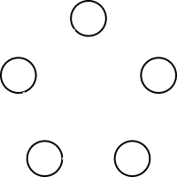
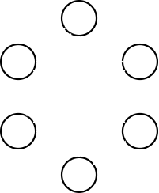
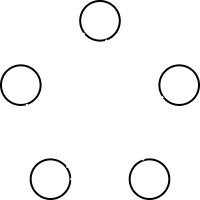

# Ghost Hunter Simulator
This is a university project (in collaboration with [Seçkin Yağmur Ergin](https://github.com/xaelxx14), [Tom Roland--Roudil](https://github.com/Tom2R) and [Simon Berger](https://github.com/simsim78berger-droid)) that aims to study the Ghost Hunter game described as follow:
- We have a connected graph `G`
- The ghost start on a random vertex `v` in `V(G)`
- The ghost hunter isn't placed in `G` and cannot see the ghost
- The goal of the hunter is to guess the location of the ghost
- Each turn:
1. The ghost hunter choose a vertex to guess the ghost position
2. If the ghost is on the said-vertex, the ghost hunter wins
3. Otherwise, the ghost move on a neighbor of its current vertex and the ghost hunter have to guess another vertex the next turn

The hunter wins if he has a strategy to catch the ghost in a finite number of rounds, otherwise the ghost wins.

This java implementation aims to simulate the `Ghost Hunter` game with multiple parameters. The goal is to allow anyone to confirm conjectures and observations on graphs (be aware, this not a tool to prove). In any case, the framework will give you the average number of round needed in order to finish a game for each experiment graph.

## Usage
0. Requirements:
- java-17
- maven

1. Clone this git repository:
```bash
git clone git@github.com:diaarca/ghost-hunter.git
```

2. Navigate to the project directory :
```bash
cd baby-tetris
```

3. Build the project :
```bash
mvn compile
```

4. Run the simulator :
```bash
./run.sh <config-path>
```

## Simulator Configuration
In order to configure your execution, you have a `config.toml` file as a configuration template. In this file you will find the following parameters:

1. `nbSimu`: a natural positive integer which describe the number of time you want to repeat your execution.
2. `policy`: the hunter strategy to use in order to chase the ghost over the graph.s.
   Below the accepted values for this parameter:

- "RANDOM": the hunter will choose at each round any vertex of the graph except the previous one (works on any `graphType` and any `execType`)
- "HIGH_DEGREE_PRIO": the hunter will choose at each round a random vertex of the graph to guess, but here high degree vertices have a greater chance of to be choose (works on any `graphType` and any `execType`)
- "NEXT_VERTEX": the hunter will choose the vertex in a direction until he finds the ghost (works on `graphType` = "N_CYCLE")

3. `execType`: the execution types are:

- "SINGLE": the framework will repeat `nbSimu` times the experiment with the given `policy` over the given `graphType` (works on `graphType` = "N_CYCLE", "N_COMP" and "FROM_FILE")
- "UP_TO_SIZE": the framework will repeat `nbSimu` times the experiment with the given `policy` over all constructed graph with the given `graphType` from 3 vertices up to `N` vertices (works on `graphType` = "N_CYCLE", "N_COMP")
- "FAMILY": the framework will repeat `nbSimu` times the `policy` over all constructed graphs with the given `graphType` in the family (works on any `graphType` but the only interesting with = "N_K_REGULAR")

4. `graphType`: the type of graph to be constructed for the experiment:

- "N_CYCLE": correspond to a cycle with N vertices

There is a 5_CYCLE:



- "N_COMP": correspond to a complete graph with N vertices

There is a 5_COMP:


- "N_K_REGULAR": correspond to a K regular graph with N vertices (N\*K must be pair number)

There is a 6_3_REGULAR:



- "N_CONN": correspond to a connected graph with N vertices

There is a 5_CONN:



- "FROM_FILE": correspond to a graph loaded from the given filename with the number of vertices and then the adjacency matrix (the graph must be connected):

There is a 7_CYCLE described in a file:

```
7
0 1 0 0 0 0 1
1 0 1 0 0 0 0
0 1 0 1 0 0 0
0 0 1 0 1 0 0
0 0 0 1 0 1 0
0 0 0 0 1 0 1
1 0 0 0 0 1 0
```

5. `filename`: the path the file from which you want to load the graph (works with any `graphType` but ignored if != "FROM_FILE")
6. `N`: the number of vertices (positive) of the graph you want to construct, or if used with `execType` = "UP_TO_SIZE" correspond to the maximum constructed graph size (works with any `graphType` but ignored if = "FROM_FILE")
7. `K`: the second parameter (positive) for graph construction (works with any `graphType` but ignored if != "N_K_REGULAR")
