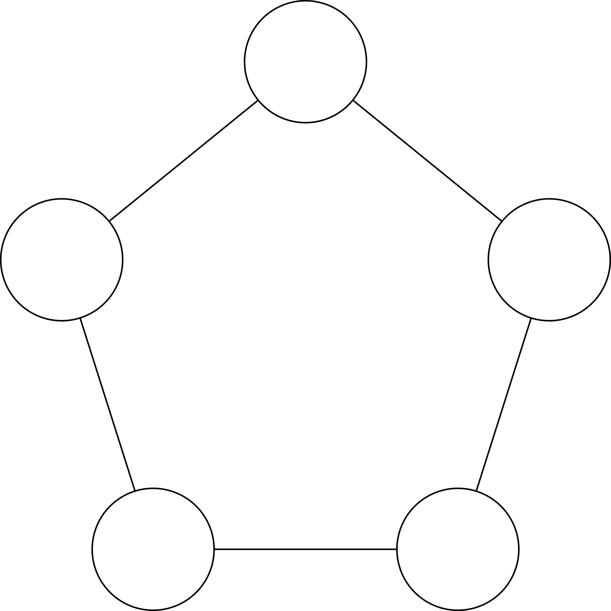
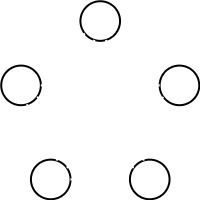

# Ghost Hunter Simulator
This java implementation aims to simulate the `Ghost Hunter` game with multiple parameters. The goal is to allow anyone to confirm conjectures and observations on graphs (be aware, this not a theorem prover). In any case, the framework will give you the average number of round needed in order to finish a game for each experiment graph.

In order to configure your execution, you have a `config.toml` file as a configuration template. In this file you will found the following parameters:
1. `nbSimu`: a natural integer which describe the number of time you want to repeat your execution.
2. `policy`: the hunter strategy to use in order to chase the ghost over the graph.s.
Below the accepted values for this parameter:
- "RANDOM": the hunter will choose eat each round any vertex of the graph except the previous one (works on any `graphType`)
- "NEXT_VERTEX": the hunter will choose the vertex in a direction until he find the hunter (works on `graphType` = "N_CYCLE")
3. `execType`: the execution type to apply over these ones:
- "SINGLE": the framework will repeat `nbSimu` times the experiment with the given `policy` over the given `graphType` (works on `graphType` = "N_CYCLE", "N_COMP" and "FROM_FILE")
- "UP_TO_SIZE": the framework will repeat `nbSimu` times the experiment with the given `policy` over all constructed graph with the given `graphType` from 3 vertices up to `N` vertices (works on `graphType` = "N_CYCLE", "N_COMP")
- "FAMILY": the framework will repeat `nbSimu` times the `policy` over all constructed graphs with the given `graphType` in the family (works on `graphType` = "N_K_REGULAR")
4. `graphType`: the type of graph to be constructed for the experiment:
- "N_CYCLE": correspond to a cycle with N vertices

There is a 5_CYCLE:


- "N_COMP": correspond to a complete graph with N vertices

There is a 5_COMP:


- "N_K_REGULAR": correspond to a K regular graph with N vertices

There is a 6_3_REGULAR:


- "FROM_FILE": correspond to a graph loaded from the given filename with the number of vertices and then the adjacency matrix (the graph must be connected):

There is a 7_CYCLE described in a file:
```
7
0 1 0 0 0 0 1
1 0 1 0 0 0 0
0 1 0 1 0 0 0
0 0 1 0 1 0 0
0 0 0 1 0 1 0
0 0 0 0 1 0 1
1 0 0 0 0 1 0
```
5. `filename`: the path the file from which you want to load the graph (works with any `graphType` but ignored if != "FROM_FILE")
6. `N`: the number of vertices of the graph you want to construct, or if used with `execType` = "UP_TO_SIZE" correspond to the maximum constructed graph size (works with any `graphType` but ignored if = "FROM_FILE")
7. `K`: the second parameter for graph construction (works with any `graphType` but ignored if != "N_K_REGULAR")

